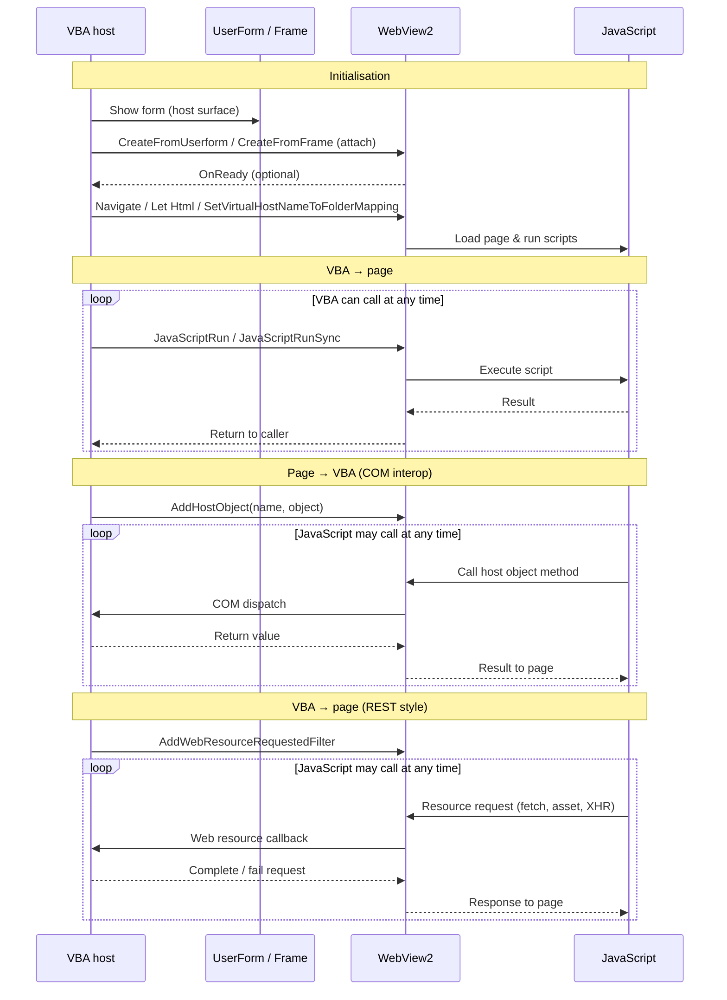
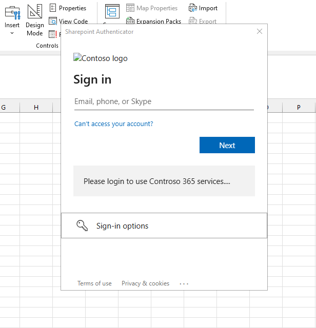

**Keywords:** VBA, WebView2, Excel automation, process engineering, business process automation, interactive visualisation

---

# `stdWebView`: Embedding Modern Web Interfaces in Legacy VBA Systems with WebView2

## Abstract

Interactive interfaces for engineering and business process analysis are often implemented as heavyweight web applications that require specialist web skills and ongoing maintenance. In many industrial environments, however, Microsoft Excel and Visual Basic for Applications (VBA) remain the most accessible integration layer for operational data, reporting, and decision support. This paper presents `stdWebView`, an open source VBA class module that embeds Microsoft Edge WebView2 in VBA UserForms, enabling rich HTML/CSS/JavaScript interfaces while retaining VBA as the orchestration layer.

We describe the architecture of `stdWebView`, practical interop patterns (host object injection, script execution, and request interception), and representative examples that demonstrate how portable, maintainable interfaces can be delivered without introducing server infrastructure. _We also outline domain case studies spanning chemical, food, infrastructure, and process management contexts, and propose a set of reusable example templates for business process and website automation._

The contribution is a pragmatic, engineering-focused methodology for teams that need modern user experience and automation capabilities inside existing Office/VBA ecosystems.

----

## Motivation

VBA has seen little substantive evolution for decades[<sup>[9]</sup>](#ref-9 "Wikipedia: VBA version history")<sup>,</sup>[<sup>[10]</sup>](#ref-10 "Microsoft: Last major VBA update") and is often labeled a legacy technology. Yet it remains one of the most widely deployed languages in financial modelling, reporting, data processing, and operational automation across finance, manufacturing, logistics, and government[<sup>[1]</sup>](#ref-1 "Berger 2025")<sup>,</sup>[<sup>[2]</sup>](#ref-2 "Abisoye and Akerele 2021")<sup>,</sup>[<sup>[3]</sup>](#ref-3 "Agrrawal 2009")<sup>,</sup>[<sup>[4]</sup>](#ref-4 "Barbieri et al. 2024")<sup>,</sup>[<sup>[5]</sup>](#ref-5 "Feiman 2011")<sup>,</sup>[<sup>[6]</sup>](#ref-6 "Khan et al. 2021"). Its persistence follows from its ubiquity in Microsoft Office, tight alignment with spreadsheet workflows, and the cost and risk of replacing large macro codebases. Just as importantly, VBA confers an implicit local maintenance guarantee: domain teams can own their tools and adapt them quickly, which centralised platforms often fail to provide.

This reliance creates corresponding technical debt. Many VBA applications are assembled incrementally by non-specialists, yielding fragile codebases and UserForms that struggle with contemporary interaction patterns. For numerous internal tools, a full migration to a standalone web application is disproportionate in cost and delivery complexity. The emergence of generative AI accentuates the gap, since it is generally more effective at producing web UI code than at generating robust VBA architecture or maintainable UserForm logic[<sup>[11]</sup>](#ref-11 "Survey: Code LLMs for low-resource DSLs"). Restricted IT environments also keep VBA relevant as a practical integration layer for on-premise systems, local files, and legacy data sources that newer sandboxed platforms cannot easily reach.

The central claim of this paper is that WebView2 integration is not merely a usability enhancement but an architectural requirement for many modern tools. Current workflows depend on capabilities that classic UserForms cannot efficiently deliver, including dynamic data grids, geospatial interfaces, graph and network visualisation, rich text components, and responsive layouts in our observed projects. Even with modern libraries such as `stdVBA`, closing this gap natively entails building and maintaining bespoke controls under a host not designed for today's UI demands.

Embedding WebView2 within VBA provides a pragmatic third path. It preserves existing Office automation and integration while unlocking the web ecosystem of UI frameworks and components. Teams can modernise incrementally, replacing the most fragile interfaces first, reusing proven web patterns, and improving maintainability without pausing operations. In effect, this approach evolves VBA systems so they meet present-day expectations for usability, reliability, and speed of change.

### Contribution

This paper makes four major contributions. First, it presents `stdWebView`, an open source VBA class module, developed as part of the broader `stdVBA` library, that embeds Microsoft Edge WebView2 within VBA UserForms, providing a practical software artifact for modernizing Office-based applications with HTML, CSS and JavaScript[<sup>[19]</sup>](#ref-19 "Microsoft: WebView2 NuGet package"). Second, it defines a practical integration architecture for VBA, that abstracts low-level COM event handling and WebView2 lifecycle management behind a high-level interface for navigation, JavaScript execution, host-object communication, HTTP request interception, and cookie management. Third, it demonstrates the applicability of this approach through case studies and examples, showing how web interfaces can be introduced into existing Excel/VBA workflows without requiring server infrastructure or full migration to a standalone web application. Finally, this approach provides a practical pathway for phased migration from legacy VBA applications towards modern web apps.

## Results

`stdWebView` exposes a small VBA API for embedding WebView2 into native UserForms and offers communication mechanisms to allow transfer of data / commands between the VBA and JavaScript runtime environments[<sup>[19]</sup>](#ref-19 "Microsoft: WebView2 NuGet package"). Typical usage involves attaching the WebView to a `MSForms.Userform` or `MSForms.Frame`, navigating to sites or injecting HTML/CSS/JS, and either hijacking the webrequest system to serve pages and data requests like a regular HTTP server or injecting a host COM object which javascript can automate directly. Consult the sequence diagram below for an overview of the functionality.



## Case studies

### Geospatial map

Geospatial UI is one of the most complicated user interfaces to build from scratch and there are no existing geospatial map libraries for VBA, which don't also require installation from administrators. Reimplementing projections, tiling, layers, editing tools etc. is a lot of work and even if you managed to reimplement all of these tools, without folders to organise code in the VBA IDE any project you use this library in will quickly become a jumbled mess of classes for the GIS UI element and classes for the actual app/business logic, making implementation in pure VBA unfeasible.

Web technologies, however, already have established packages for geospatial tools and UI elements e.g. Leaflet, Proj4, TurfJS, EsriJS...  Our first case study shows how a simple geospatial map element can be implemented within 200 lines of VBA using `stdWebView`. This demonstration shows how html can be injected into a webview, and adding a host object can be used to automated VBA from inside the web application.

While `stdWebView` doesn't fix VBA project ergonomics, it moves the UI code which is hard in VBA, to HTML/JS providing significantly greater flexibility, and the ability to use custom libraries written by other developers. The VBA side ultimately becomes a bridge of bindings to the data model, rather than operating the whole vision.

[Link to project](https://github.com/sancarn/stdVBA-examples/tree/main/Examples/WebView/2.%20Geospatial%20Map)


### List object viewer

One of the main reasons people build UserForms in VBA is to display and edit structured data. A common pattern is fill a textbox from a template, and some handlebar syntax to quickly display data. You can build dynamic UIs in VBA, but hooking up events for controls you create at runtime is awkward, so most forms end up as a fixed set of labels and boxes laid out by hand. That takes a lot of time, and it gets painful when the data isn't fl1at. For instance, one employee with a list of next steps sitting underneath. In HTML/CSS/JS, layouts that change with the data are the normal way of working, not a special case.

Our list object viewer case study is a simple example of that: open a UserForm, step through rows in an Excel table, and a `stdWebView` panel shows that row's employee details plus the next steps linked to them. The same screen in pure VBA would be tedious to build, a headache to maintain and provide a poorer user experience.

[Link to project](https://github.com/sancarn/stdVBA-examples/tree/main/Examples/WebView/1.%20ListObjectViewer)


### Customising existing organisation webapps

Over the last couple of decades most large organisations have moved toward cloud-hosted, browser-based tools, accelerated by remote working during COVID-19. The platforms IT rolls out are usually deliberately generic. Applications tend to be useful to lots of teams, but rarely shaped around one team's exact workflow.

SharePoint is a typical example of this, with lists, files, and permissions that work well for everyone, but not necessarily your team's specific business process. Custom scripting inside SharePoint can often be turned on in admin settings, yet in practice it is frequently disabled for security reasons. That leaves domain teams stuck between "use the standard app as-is" and "wait for a bespoke IT project."

A `stdWebView` UserForm can sit in the gap. The user signs in to the real web app inside the control; you reuse that session (for example via cookies) to call the same APIs and pages the browser would, on their behalf. Or you skip deep integration and simply host a small HTML UI that wraps a narrow task with extra buttons, validation, or a wizard. These controls can be integrated into the host application, retaining the feeling like they're part of the tool they already use.

[Link to project - sharepoint updator](https://github.com/sancarn/stdVBA-examples/tree/main/Examples/WebView/4.%20Sharepoint%20Updator)



[Link to project - pylon augmentation](https://github.com/sancarn/stdVBA-examples/tree/main/Examples/WebView/6.%20Augment%20pylon%20map)


### Data flows driven by node editors

When it comes to rendering VBA tends to offer strict controls that always draw the same kind of UI, and rarely do they allow truly custom looking UI to be created. Although it is possible to use GDI32[<sup>[12]</sup>](#ref-12 "GDI32 reference") or GDI+[<sup>[13]</sup>](#ref-13 "GDI+ reference") libraries targetting a hwnd to draw custom UI on top of a VBA userform, this tends to be convoluted and requires deep knowledge of the stacks in question. Additionally, if what you are rendering requires shaders, both GDI and GDI+ are a no-go, and the only viable alternative for anything close to GPU processing is OpenCL or DirectX, both of which are convoluted libraries with steep learning curves.

Our pipeline editor case study shows how a webview could give users a low-code way to build data pipelines. Instead of trying to recreate a complex visual editor in native VBA controls, the interface can offer the kind of polished interactions people already expect from websites, from context-aware actions and searchable node insertion through to expression intellisense from table/file metadata.

That richer experience comes from using HTML5, CSS, and JavaScript libraries for the frontend while keeping data persistence, business logic, and side-effects in VBA via `stdWebView`'s interoperability layer. The result is a more approachable and maintainable way to build dataflows than would be practical with VBA forms alone.

[Link to project](https://github.com/sancarn/stdVBA-examples/tree/main/Examples/WebView/5.%20Data%20Pipelines)


### Benefits and trade-offs

Using webview userforms opens up a world of sophisticated UI features and access to the powerful ecosystem of modern JavaScript libraries, but this flexibility comes with a new set of complexities. Instead of spending most of your time on laborious VBA userform layouts, you're now navigating asynchronous JavaScript, cross-language communication, and the quirks of both JS/HTML/CSS and native VBA code. Debugging can become more involved and there are new deployment considerations, from ensuring that WebView2 is present, to managing security boundaries in mixed web/native applications. 

Additionally, many JavaScript ecosystem tools rely on build pipelines and frameworks (Webpack, Vite, React, etc.), introducing even more options, abstractions, and dependencies into your development process. For some VBA developers, the simplicity and constraint of native VBA components might be preferable.

## Technical Design of `stdWebView`

### Dependency free design

`stdWebView` creates an instance of `WebView2` using a pre-installed `WebView2Loader.dll`, found in `C:\Program Files\Microsoft Office\root\Office16\ADDINS\Microsoft Power Query for Excel Integrated\bin`, which is included with Microsoft Excel as part of its PowerQuery integration. This approach, originally discovered by VBA user tarboh[<sup>[14]</sup>](#ref-14 "tarboh: WebView2 For Excel VBA"), is notable for enabling the creation of a `WebView2` instance without needing to install additional type libraries or binaries—an action that would typically require admin rights, which is often infeasible in business environments. To bypass the requirement for a registered type library, Tarboh uses a well-known advanced technique[<sup>[15]</sup>](#ref-15 "sancarn: stdCOM.cls")<sup>,</sup>[<sup>[16]</sup>](#ref-16 "vbForums: VB6 Call Functions By Pointer") where the `DispCallFunc` function from `OleAut32.dll` is used to invoke methods directly via their vtable (virtual method table) pointers and function offsets, effectively emulating the way C code might call COM object members. This technique provides late-bound, vtable-driven COM interop from VBA code with no external dependencies beyond what's already shipped with Office.

While tarboh's approach is arguably the most feature complete solution for WebView2 interop it falls into the classic VBA trap where it requires 6 dependencies. For small projects this makes the codebase feel verbose and over-engineered. Where `stdWebView` diverts away from tarboh's approach is by introducing a `Win64` port of an x86 thunk, used to create pointers to class' `public` instance methods. 

Ultimately, this design makes the vision of a dependency-free, self-contained `stdWebView` a reality. The entire module can be dropped into any project without extra complexity, setup, or separate installations. Further details on the technicalities of the mechanisms used to execute this are provided in the following sections.

### Late-Bound COM Interop

`WebView2` exposes much of its native API through COM interfaces and asynchronous callbacks. In C++ or .NET, a developer would normally implement the required callback interfaces directly and pass those objects to `WebView2`. VBA does not provide a convenient way to implement arbitrary `WebView2` callback interfaces, nor does it expose raw function pointers for instance methods in the way native APIs expect. As a result, `stdWebView` needs an interop layer that can both call `WebView2` methods and present VBA methods as callback targets. 

It's worth noting that much of this extra complexity comes from the desire to keep `stdWebView` entirely self-contained as a single class. For example, Tarboh's approach leverages the `AddressOf` mechanism to obtain function pointers to procedures in a standard module, which makes callback registration much simpler. However, this requires developers to add and manage extra modules, defeating the goal of a true single-drop, dependency-free solution. The design here deliberately avoids those dependencies, keeping all required logic encapsulated within one class.

As documented in API calbacks using an objects procedures[<sup>[17]</sup>](#ref-17 "vbForums: API CallBacks Using an Object's Procedure") VBA (and VB6) objects are COM objects, with the following VTable layout. Each object instance stores a pointer to its public vtable, the address returned by `ObjPtr(o)`, whose entries are laid out in memory beginning with the standard `IUnknown` and `IDispatch` methods, followed by pointers to the class's own developer defined public methods.

```
ObjPtr(o) --> [IUnknown::QueryInterface]
              [IUnknown::AddRef]
              [IUnknown::Release]
              [IDispatch::GetTypeInfoCount]
              [IDispatch::GetTypeInfo]
              [IDispatch::GetIDsOfNames]
              [IDispatch::Invoke]
              [Public method 1]
              [Public method 2]
              ...
              [Public method n]
              [Private/Friend methods (arbitrary order)]
```

> Internally, the VB runtime maintains additional metadata immediately adjacent to the vtable (used for private members and other bookkeeping), but that is unrelated to this mechanism and not used here.

### Adapting VBA Methods into Native Callbacks

With a known pointer size (determined by the host's bitness), we can compute the address of the N‑th public method directly. However, locating that address is only half the challenge because object methods expect the `this` pointer (the object's instance) to be passed along with a method call, while a typical C callback jumps directly to a bare function address.

To reconcile the two calling conventions, we (and Elroy) generate a small thunk, a short block of executable code, that prepends the object instance pointer each time the function is called. The address of the thunk is then returned and can be used as a conventional callback function pointer in APIs that expect one.

In addition, our implementation introduces `EBMode` protection, inspired by the work of TheTrick[<sup>[18]</sup>](#ref-18 "TheTrick: VbTrickTimer"). This enhancement extends Elroy's original thunk by detecting when the VBA IDE is in break mode and suppresses callback execution as to avoid Office application crashes.

These thunks are used to build minimal COM callback handlers (light-weight COM objects with `IUnknown` + `Invoke`) which are registered with `WebView2` as the core native interop layer. These callbacks are used in initialisation, and in ongoing event handlers when web resources are requested, to detect script completion and to retrieve cookie information.

### Invoking VBA from JavaScript

While it might be thought that direct calls from JavaScript to VBA are achieved in this way, instead this is achieved by utilising the standard `WebView2` API's host object functionality. Any object that implements the IDispatch interface can serve as a host object, and conveniently this includes all VBA objects. This allows you to expose any VBA class or object to JavaScript by registering it, enabling JavaScript code to call into VBA through that object.

As with many `stdVBA` modules, `stdWebView` has one minor dependency on `stdICallable`. While adding any dependency is not ideal, `stdICallable` is the key component that enables integration with the rest of `stdVBA` ecosystem. Callback support in `stdWebView` is optional, but when needed, it works seamlessly with standard `stdLambda` or `stdCallback` objects.

### Considerations

While `stdWebView` greatly extends the possibilities of VBA, it also introduces certain trade-offs that should be carefully weighed when deciding if it is the appropriate choice for your project. For starters, `stdWebView` is only compatible on Windows OS. In principle, a similar class could be designed for MacOS with `SafariView` or `WKWebView`, but such an implementation would need a different architecture. MacOS lacks the COM infrastructure, and executable memory model that `stdWebView` relies on, and the thunking techniques used for callback integration would not function under its sandboxed runtime. Thus, at present, if your product is intended for cross-platform functionality, Userforms remain important. Additionally, there is a reliance on `WebView2`, which relies upon the chromium version of Edge. This version of edge is fully supported on Windows 10+, however if you are on previous versions of Windows OS the runtime being installed is not guaranteed.

A key implementation detail is that `stdWebView` currently bootstraps `WebView2` using the `WebView2Loader.dll` shipped with Excel (via PowerQuery components). Although this enables dependency-free deployment in many managed environments, this behavior is not a documented or guaranteed public contract for Office. Consequently, future Office updates, or enterprise hardening policies may alter or remove this availability. The approach should therefore be treated as opportunistic rather than guaranteed, and production deployments should include a fallback strategy. A copy of `WebView2Loader.dll` can be downloaded and extracted from the official `WebView2` nuget package[<sup>[19]</sup>](#ref-19 "Microsoft: WebView2 NuGet package").

Although WebViews work well on both large and small projects, it should be noted that making an Excel Workbook entirely distributable may involve steering away from usage of HostName to folder mappings. Unless the HTML application is stored in a centralised remote drive, accessible to all users in the organisation, extremely large javascript applications may be infeasible to distribute or maintain. If no such remote location exists in your organisation, large codebases would either have to be written in minified javascript strings in the VBE, or code copy/pasted into Excel shapes and accessed using `ThisWorkbook.Sheets("SheetName").Shapes("ShapeName").TextFrame2.TextRange.Text`. Excel Shapes are not designed to store hundreds of lines of text, and shape performance has been known to degrade when trying to modify huge volumes of text in a shape, to the point it becomes more feasible to set the text programmatically rather than manually. It should be noted that building to a single html file, may also increase the complexity of the build process to keep the javascript front end easy to maintain while also being able to embed it in an Excel document.


An alternative approach may be to store the entire HTML application in the zipped `xlsm` binary. With this option, the file will be unzipped at runtime to a temporary directory, and a hostname to folder mapping would be configured at initialisation. However, care must be taken to update the `[Content_Types].xml` files with all extensions used in the application payload, such that the additional files do not trigger an Excel file corruption error. It may be prudent to store the webview data as a zip file too, to make this process easier. For what it's worth there are existing resource file editors which achieve this[<sup>[20]</sup>](#ref-20 "Leandro Ascierto: VBA resource file editor").

It is also important to note that adopting this split architecture and augmenting VBA with modern JavaScript frontends, represents a significant shift for many developers, and the approach comes with its own learning curve. While this expansion into the JavaScript ecosystem offers tremendous potential for modernizing VBA's capabilities, it is still a relatively new pattern in the Office/VBA world, and some aspects of maintainability or team familiarity may lag behind more traditional approaches. For VBA developers in particular, keeping up with changes in web tooling and best practices may present challenges. Fortunately, large language models (LLMs), especially when available within agentic IDEs, can help bridge this gap by providing effective coding assistance, workflow guidance, and facilitating learning, making transition and maintenance more manageable even for those with less JavaScript experience.

#### Security considerations

The upmost care should be taken when navigating WebView2 to untrusted locations while also exposing VBA/COM host objects. In principle, any host objects could be utilised by a 3rd party attacker to extract data from an organisation. This means extra care must be put into defining the object models which untrusted websites are given access to.

For example, if you are wanting to implement a feature where hyperlinks are launched when you click on a button in the webview do not use `Shell` function directly[<sup>[21]</sup>](#ref-21 "BleepingComputer: Windows 11 Notepad markdown links issue") without any link sanitisation, or unless you generate the string inside your VBA environment.

```
'DONT DO THIS:
Public Sub OpenLink(ByVal link as string)
  Call ThisWorkbook.FollowHyperlink(link)
End Sub

'DO THIS:
Public Sub OpenLink(ByVal link as string)
  link = LCase(Trim(link))
  if not InStr(1, link, "https://my/site") = 1 then Err.Raise vbObjectError + 513, "OpenLink", "URL Blocked"
  Call ThisWorkbook.FollowHyperlink(link)
End Sub

'Ideally do this:
Public Sub OpenGoogleMaps(ByVal lat as Double, ByVal long as Double)
  const url_template as string = "https://maps.google.com?q={lat},{long}"
  Dim url as string: url = url_template
  url = replace(url, "{lat}", lat)
  url = replace(url, "{long}", long)
  Call ThisWorkbook.FollowHyperlink(url)
End Sub
```

An additional risk that needs to be considered is that of supply chain attacks, which occur when a third-party library included in your project (such as a JavaScript package) is compromised and used to deliver malicious code. To mitigate this risk, avoid loading assets directly from external CDNs or untrusted sources, and instead bundle required libraries locally and review their contents before deployment. Keep dependencies to a minimum and pin them to known, vetted versions. Regularly audit and update included packages, and never hand host objects directly to libraries without constraints. These steps help ensure that your VBA application remains secure even as it gains the power of modern web tooling.

It is also important to limit/constrain VirtualHost to folder mappings. By creating a folder mapping you are exposing not only the folder, but all descendents of that folder to the webview. This combined with supply chain attacks, could bring serious risk of data leaks without developer prudence.

All things considered, cyber security is a major consideration with this technology, and extra care should be untertaken in how you manage these security risks in your projects, so as to ensure data isn't leaked and your applications remain secure. The key take-aways are as follows:

* Treat all web content as insecure
* Avoid generic proxies
* Validate all message payloads/host object params.
* Restrict webview features if not required

For additional guidance on how to keep `WebView2` applications secure, check out the Microsoft security guidance[<sup>[22]</sup>](#ref-22 "Microsoft Learn: WebView2 security guidance").

## 5. Conclusion


This paper has argued that embedding WebView2 in VBA is not simply a cosmetic upgrade to UserForms, but a practical architectural pattern for extending the lifespan and capability of systems built in Microsoft Office. `stdWebView` demonstrates that rich, modern interfaces can be integrated into existing Excel/VBA workflows while retaining VBA as the orchestration layer for data access, automation logic, and enterprise integration.

Across the examples presented, the key value lies in establishing a repeatable bridge between VBA and web runtimes. With this approach, VBA drives the interface, JavaScript can call back into controlled host objects, and request interception enables modern programming patterns without the need for dedicated server infrastructure. This structure allows teams to modernize incrementally, upgrading the most fragile UI layers first and avoiding the need for wholesale migration.

The approach does introduce trade-offs, including a steeper cross-stack learning curve, Windows/WebView2 platform constraints, and meaningful security responsibilities when exposing host capabilities to web content. That said, for many internal engineering and operations tools, these constraints are often preferable to the cost and disruption of full platform replacement. In that context, `stdWebView` offers a pragmatic middle path: preserve proven VBA assets, adopt modern interface practices where they deliver clear value, and evolve legacy systems in controlled, maintainable stages.

## References

* <a id="ref-1"></a>[1] Berger, H. (2025). Visual Basic for Applications as a Strategic Tool in the Age of End User Computing. Proceedings of E-Journal Unibit, 4, 51-55. https://e-journal.unibit.bg/images/proceedings/2025/issue-4/
* <a id="ref-2"></a>[2] Abisoye, O., & Akerele, O. (2021). Optimizing Academic Operations with Spreadsheet-Based Forecasting Tools and Automated Course Planning Systems. International Journal of Multidisciplinary Studies, 4(1), 116. https://www.allmultidisciplinaryjournal.com/uploads/archives/20250721111136_MGE-2025-4-116.1.pdf
* <a id="ref-3"></a>[3] Agrrawal, P. (2009). An automation algorithm for harvesting capital market information from the web. Managerial Finance, 35(5), 427-438. https://doi.org/10.1108/03074350910949790
* <a id="ref-4"></a>[4] Barbieri, F., Cannava, L., Colicchia, C., & Perotti, S. (2024). Modelling the environmental performance of logistics distribution processes: a business case in the agri-food supply chain. Benchmarking: An International Journal, 32(1), 51-78. https://doi.org/10.1108/bij-07-2024-0634
* <a id="ref-5"></a>[5] Feiman, M. (2011). A Financial Modeling Whitepaper. University of Huddersfield Repository. https://eprints.hud.ac.uk/id/eprint/12260/1/FeimanWhat_Everyone_Needs_to_Know_about_Financial_Modeling.pdf
* <a id="ref-6"></a>[6] Khan, M. A., Kalwar, M. A., & Chaudhry, A. K. (2021). Optimization of material delivery time analysis by using Visual Basic for applications in Excel. Journal of Applied Research in Technology & Engineering, 2, 89. https://doi.org/10.4995/jarte.2021.14786
* <a id="ref-7"></a>[7] MDPI. (2025). Automated Ledger or Fintech Analytics Platform? FinTech, 4(2), 14. https://www.mdpi.com/2674-1032/4/2/14
* <a id="ref-8"></a>[8] MDPI. (2025). Implementing CAD API Automated Processes in Engineering Design: A Case Study Approach. Applied Sciences, 15(14), 7692. https://www.mdpi.com/2076-3417/15/14/7692
* <a id="ref-9"></a>[9] Wikipedia. Update history. https://en.wikipedia.org/wiki/Visual_Basic_for_Applications#Version_history
* <a id="ref-10"></a>[10] Microsoft. Last major update. https://learn.microsoft.com/en-us/office/vba/language/concepts/getting-started/64-bit-visual-basic-for-applications-overview
* <a id="ref-11"></a>[11] Survey-CodeLLM4LowResource-DSL. https://github.com/jie-jw-wu/Survey-CodeLLM4LowResource-DSL
* <a id="ref-12"></a>[12] author: Arkham46. GDI32 reference. https://arkham46.developpez.com/articles/office/clgdi32/
* <a id="ref-13"></a>[13] author: Arkham46. GDI+ reference. https://arkham46.developpez.com/articles/office/clgdiplus/
* <a id="ref-14"></a>[14] author: tarboh. WebView2 For Excel VBA. https://github.com/tarboh/WebView2-For-Excel-VBA
* <a id="ref-15"></a>[15] author: sancarn. `stdCOM.cls`. https://github.com/sancarn/stdVBA/blob/master/src/stdCOM.cls
* <a id="ref-16"></a>[16] author: LaVolpe. VB6 Call Functions By Pointer (Universall DLL Calls). https://www.vbforums.com/showthread.php?781595-VB6-Call-Functions-By-Pointer-(Universall-DLL-Calls)
* <a id="ref-17"></a>[17] author: Elroy. API CallBacks Using an Object's Procedure. https://www.vbforums.com/showthread.php?898136-API-CallBacks-Using-an-Object-s-Procedure
* <a id="ref-18"></a>[18] author: TheTrick. EBMode reference. https://github.com/thetrik/VbTrickTimer
* <a id="ref-19"></a>[19] author: Microsoft. WebView2 NuGet package. https://www.nuget.org/packages/Microsoft.Web.WebView2
* <a id="ref-20"></a>[20] author: Leandro Ascierto. VBA resource file editor. https://leandroascierto.com/blog/vba-resource-file-editor/
* <a id="ref-21"></a>[21] BleepingComputer. Windows 11 Notepad flaw let files execute silently via markdown links. https://www.bleepingcomputer.com/news/microsoft/windows-11-notepad-flaw-let-files-execute-silently-via-markdown-links/
* <a id="ref-22"></a>[22] Microsoft Learn. WebView2 security guidance. https://learn.microsoft.com/en-us/microsoft-edge/webview2/concepts/security?tabs=dotnetcsharp


<!--

## Dev Remarks:

* TOADD: At OpenCL: It seems directX does have shaders:

```c
const char* src =
    "float4 main() : SV_Target { return float4(1,0,0,1); }";

ID3DBlob* code = NULL;
ID3DBlob* errors = NULL;

HRESULT hr = D3DCompile(
    src,
    strlen(src),
    "inline",
    NULL,
    NULL,
    "main",
    "ps_5_0",
    0,
    0,
    &code,
    &errors
);
```


Search for: `’` and replace with `'`
-->